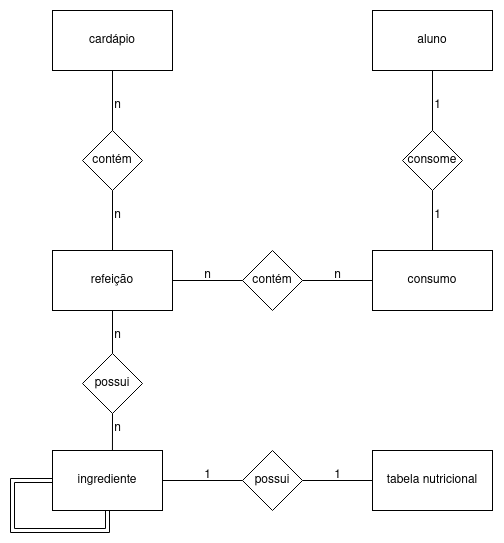
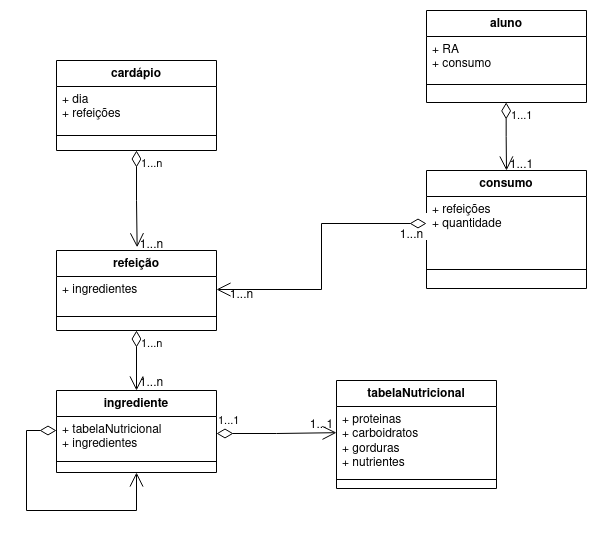

# Modelo para Apresentação do Lab02 - Modelagem Conceitual de Refeições em um Restaurante

# Equipe GPALT

# Subgrupo B
* Thiago Mota Martins - 223485
* Lawrence Francisco Martins de Melo - 223480
* Alexia Bettoni do Nascimento - 265670

## Modelo Conceitual ER

# Modelo Conceitual UML

> Coloque aqui o diagrama UML produzido pela sua equipe. O diagrama deve detalhar atributos e cardinalidade. Será valorizado o uso de herança, agregação e composição, quando pertinente.

