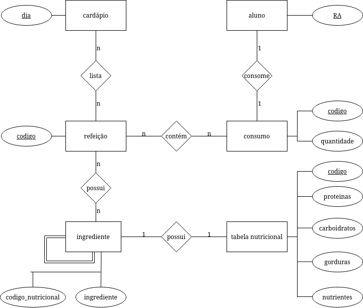

# Modelo para Apresentação do Lab02 - Modelagem Conceitual de Refeições em um Restaurante

# Equipe GPALT

# Subgrupo B
* Thiago Mota Martins - 223485
* Lawrence Francisco Martins de Melo - 223480
* Alexia Bettoni do Nascimento - 265670

## Modelo Conceitual ER



# Mapeamento para o Modelo Relacional

```
CARDAPIO(_dia_)

REFEICAO(_codigo_, ingredientes)
    ingrediente chave estrangeira -> INGREDIENTE(_codigo_)

LISTA(dia, refeicao)
    dia chave estrangeira -> CARDAPIO(_dia_)
    refeicao chave estrangeira -> REFEICAO(codigo)

INGREDIENTE(_codigo_, codigo_nutricional, ingredientes)
    ingredientes chave estrangeira -> INGREDIENTE(codigo)
    codigo_nutricional chave estrangeira -> TABELA_NUTRICIONAL(codigo)

POSSUI(refeicao, ingrediente)
    refeicao chave estrangeira -> REFEICAO(codigo)
    ingrediente chave estrangeira -> INGREDIENTE(codigo)

TABELA_NUTRICIONAL(_codigo_, proteinas, carboidratos, gorduras, nutrientes)

ALUNO(_ra_)

CONSUMO(_codigo_, quantidade, ra)
    ra chave estrangeira -> ALUNO(ra)

CONTEM(refeicao, consumo)
    refeicao chave estrangeira -> REFEICAO(codigo)
    refeicao chave estrangeira -> CONSUMO(codigo)


```

