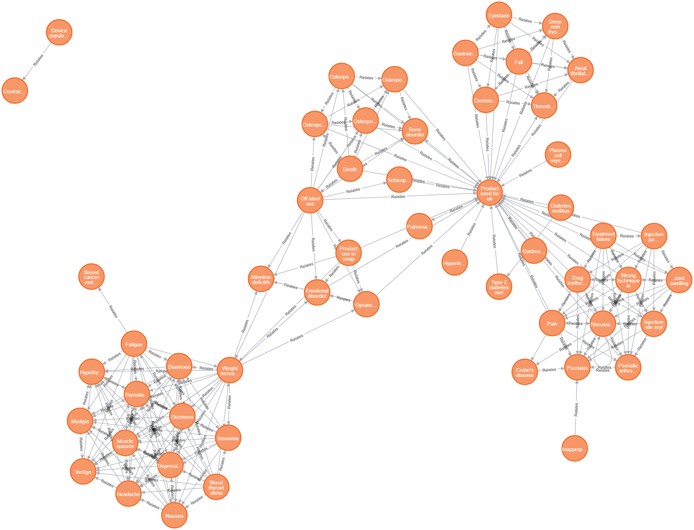

# Modelo para Apresentação do Lab06 - Comandos Avançados em Cypher


# Equipe GPALT

# Subgrupo B
* Thiago Mota Martins - 223485
* Lawrence Francisco Martins de Melo - 223480
* Alexia Bettoni do Nascimento - 265670


# Exercício 1
Primeiro vamos inicializar o grafo
```
LOAD CSV WITH HEADERS FROM 'https://raw.githubusercontent.com/santanche/lab2learn/master/data/faers-2017/drug.csv' AS line
CREATE (:Drug {code: line.code, name: line.name})
```

```
LOAD CSV WITH HEADERS FROM 'https://raw.githubusercontent.com/santanche/lab2learn/master/data/faers-2017/pathology.csv' AS line
CREATE (:Pathology { code: line.code, name: line.name})
```
```
CREATE INDEX drug_code_index FOR (n:Drug) ON (n.code)
```
```
CREATE INDEX pathology_code_index FOR (n:Pathology) ON (n.code)
```

```
LOAD CSV WITH HEADERS FROM 'https://raw.githubusercontent.com/santanche/lab2learn/master/data/faers-2017/drug-use.csv' AS line
MATCH (d:Drug {code: line.codedrug})
MATCH (p:Pathology {code: line.codepathology})
MERGE (d)-[t:Treats]->(p)
ON CREATE SET t.weight=1
ON MATCH SET t.weight=t.weight+1
```

Daqui podemos realizar a projeção que conecta as patologias que são tratadas pela mesma droga.

```
MATCH (p1:Pathology)<-[a]-(d:Drug)-[b]->(p2:Pathology)
WHERE a.weight > 20 AND b.weight > 20
MERGE (p1)<-[r:Relates]->(p2)
ON CREATE SET r.weight=1
ON MATCH SET r.weight=r.weight+1
```
```
MATCH (p1:Pathology)<-[:Relates]->(p2:Pathology)
RETURN p1, p2
```



# Exercício 2

Precisamos importar os dados de `drug-use.csv`.

```
LOAD CSV WITH HEADERS FROM 'https://raw.githubusercontent.com/santanche/lab2learn/master/data/faers-2017/drug-use.csv' AS line
CREATE (:Drug_use {id: line.idperson, code: line.codepathology, code_drug: line.codedrug})
```
```
CREATE INDEX drug_use_index FOR (n:Drug_use) ON (n.code_drug)
```