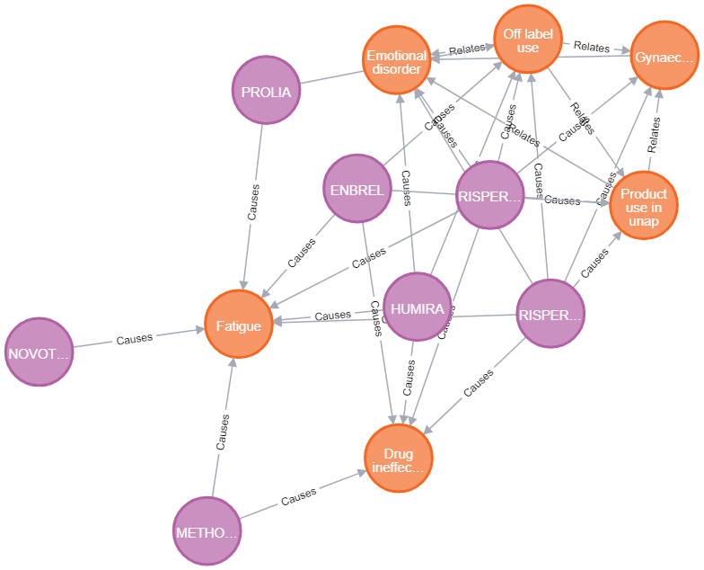

# Modelo para Apresentação do Lab06 - Comandos Avançados em Cypher


# Equipe GPALT

# Subgrupo B
* Thiago Mota Martins - 223485
* Lawrence Francisco Martins de Melo - 223480
* Alexia Bettoni do Nascimento - 265670


# Exercício 1
Faça a projeção em relação a Patologia, ou seja, conecte patologias que são tratadas pela mesma droga.

# Resolução
Primeiro vamos inicializar o grafo
```cypher
LOAD CSV WITH HEADERS FROM 'https://raw.githubusercontent.com/santanche/lab2learn/master/data/faers-2017/drug.csv' AS line
CREATE (:Drug {code: line.code, name: line.name})
```

```cypher
LOAD CSV WITH HEADERS FROM 'https://raw.githubusercontent.com/santanche/lab2learn/master/data/faers-2017/pathology.csv' AS line
CREATE (:Pathology { code: line.code, name: line.name})
```
```cypher
CREATE INDEX drug_code_index FOR (n:Drug) ON (n.code)
```
```cypher
CREATE INDEX pathology_code_index FOR (n:Pathology) ON (n.code)
```

```cypher
LOAD CSV WITH HEADERS FROM 'https://raw.githubusercontent.com/santanche/lab2learn/master/data/faers-2017/drug-use.csv' AS line
MATCH (d:Drug {code: line.codedrug})
MATCH (p:Pathology {code: line.codepathology})
MERGE (d)-[t:Treats]->(p)
ON CREATE SET t.weight=1
ON MATCH SET t.weight=t.weight+1
```

Daqui podemos realizar a projeção que conecta as patologias que são tratadas pela mesma droga.

```cypher
MATCH (p1:Pathology)<-[a]-(d:Drug)-[b]->(p2:Pathology)
WHERE a.weight > 20 AND b.weight > 20
MERGE (p1)<-[r:Relates]->(p2)
ON CREATE SET r.weight=1
ON MATCH SET r.weight=r.weight+1
```
```cypher
MATCH (p1:Pathology)<-[:Relates]->(p2:Pathology)
RETURN p1, p2
```


# Exercício 2

Construa um grafo ligando os medicamentos aos efeitos colaterais (com pesos associados) a partir dos registros das pessoas, ou seja, se uma pessoa usa um medicamento e ela teve um efeito colateral, o medicamento deve ser ligado ao efeito colateral.

# Resolução

Precisamos importar os dados de `drug-use.csv`.

```cypher
LOAD CSV WITH HEADERS FROM 'https://raw.githubusercontent.com/santanche/lab2learn/master/data/faers-2017/drug-use.csv' AS line
CREATE (:Drug_use {id: line.idperson, code: line.codepathology, code_drug: line.codedrug})
```
```cypher
CREATE INDEX drug_use_index FOR (n:Drug_use) ON (n.code_drug)
```

E então é possível importar `sideeffects.csv` realizando um merge com `Pathology`, `Drug` e `Drug_use`.

```cypher
LOAD CSV WITH HEADERS FROM 'https://raw.githubusercontent.com/santanche/lab2learn/master/data/faers-2017/sideeffect.csv' AS line
MATCH (du:Drug_use {id: line.idPerson})
MATCH (d:Drug    {code: du.code_drug})
MATCH (p:Pathology {code: line.codePathology})
MERGE (d)-[t:Causes]->(p)
ON CREATE SET t.weight=1
ON MATCH SET t.weight=t.weight+1
```

```cypher
MATCH (d)-[t:Causes]->(p)
WHERE t.weight > 50
RETURN d,p
```



# Exercício 3

Que tipo de análise interessante pode ser feita com esse grafo?

Proponha um tipo de análise e escreva uma sentença em Cypher que realize a análise.

# Resolução

Por meio dessa análise buscamos descobrir quais remédios apresentam efeitos colaterais iguais a doença que eles tratam, por isso ligamos os remédios e os efeitos/doenças buscando as que tem as duas relações simultaneamente.


```cypher
MATCH (d)-[t:Causes]->(p)
MATCH (d)-[g.Treats]->(p)
WHERE t.weight > 20 AND g.weight > 20
RETURN d,p
```