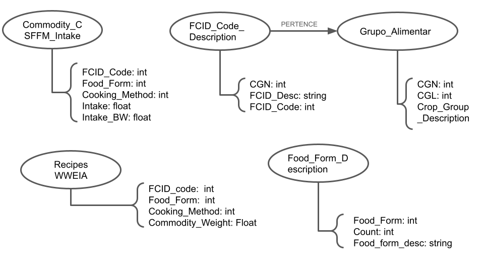
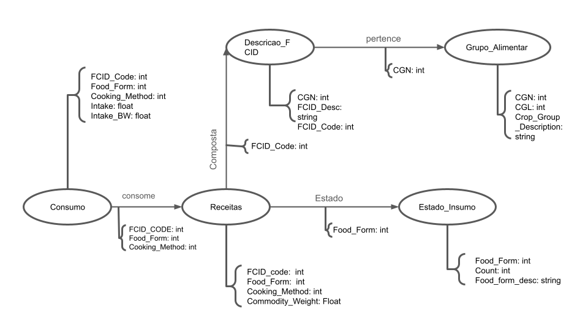

# Modelo para Apresentação do Lab07 - Modelo Lógico para Banco de Dados de Grafos

# Equipe GPALT

# Subgrupo B
* Thiago Mota Martins - 223485
* Lawrence Francisco Martins de Melo - 223480
* Alexia Bettoni do Nascimento - 265670

# Modelo Lógico do Banco de Dados de Grafos

# Perguntas de Pesquisa/Análise

* Quais grupos alimentares estão mais presentes nas receitas.
* Qual é o estado de comidas mais presente nas receitas?
* Quais são as receitas mais consumidas pelas pessoas?
* Qual é a comida presente em mais receitas?
* Quais são os métodos de consumo mais utilizados nas receitas?

