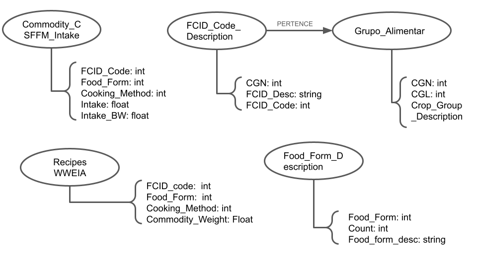
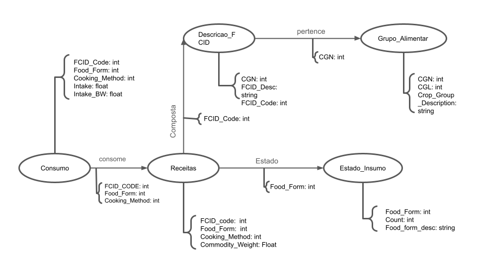

# Modelo para Apresentação do Lab08 - Modelo Lógico e Análise de Dados em Grafos

# Equipe GPALT

# Subgrupo B
* Thiago Mota Martins - 223485
* Lawrence Francisco Martins de Melo - 223480
* Alexia Bettoni do Nascimento - 265670

# Modelo Lógico do Banco de Dados de Grafos

# Perguntas de Pesquisa/Análise

## Perguntas de Pesquisa/Análise Combinadas e Respectivas Análises

### Pergunta/Análise 1
> * Pergunta 1
>   
>   * Quais grupos alimentares estão mais presentes nas receitas.
Para fazer essa análise será necessário fazer a ligação entre receitas e grupo alimentar, por meio da descrição FCID, com essa relação feita será utilizada a centralidade para ver qual grupo alimentar é o mais utilizado.

### Pergunta/Análise 2
> * Pergunta 2
>   
>   * Quais são os ingredientes mais importantes para as receitas?
Para essa análise serão necessárias duas tabelas, a de receitas e a Descricao_FCID, com elas serão feitas duas ligações entre elas e então serão ocultados os nós referente às receitas, fazendo assim com que apareçam ligação entre dois ingredientes que estão na mesma receita. Utilizando a vulnerabilidade podemos ver os nós de mais importância da rede e que se fossem retirados causariam mais impacto.

### Pergunta/Análise 3
> * Pergunta 3
>   
>   * Quais ingredientes permitem uma maior variedade de receitas?
A resposta depende de como definimos variedade, podemos inicialmente ordenar os ingredientes da tabela Descricao_FCID pelo número de receitas da tabela Receitas, em que ele está presente, mas isso não necessariamente permite uma variedade, já que podem existir várias receitas extremamente semelhantes a outras receitas. Então uma outra ideia é fazer uma projeção, conectando dois ingredientes se existir pelo menos uma receita que os dois façam parte, com isso podemos olhar a centralidade da rede gerada pela projeção. A resposta também varia com o jeito que centralidade é definido, já que queremos uma maior variedade de receitas podemos classificar a centralidade por degree.

